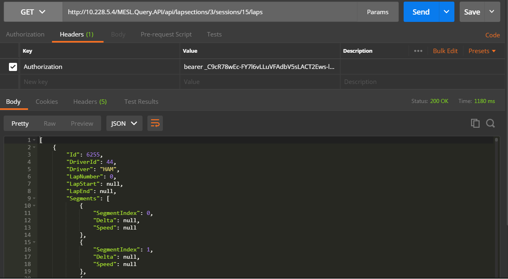

#  Telemetry Analytics API

### Table of Contents
- [**Introduction**](/README.md)<br>
- [**Installation**](/docs/Installation.md)<br>
- [**Getting started**](/docs/GettingStarted.md)<br>
- [**Identity Server**](/docs/IdentityServer.md)<br>
- [**Authentication**](/docs/Authentication.md)<br>
- [**Authentication**](/docs/Authorization.md)<br>
- [**Querying Metadata**](/docs/Metadata.md)<br>
- [**Consuming Data**](/docs/ConsumingData.md)<br>
- [**Views**](/docs/Views.md)<br>

# Authentication

This API supports OAuth2.0 Resource Owner authentication. You use your username/password to ask the server for an access token, which you will include in the headers of all requests to the server. Please note that for SqlRace, OAuth server is embedded. Hence, you can use the same API to get the access token as TAPI. However, for InfluxDb API, OAuth server is called Identity Server and is deployed as a separate API. Hence, the address of the token endpoint and Swagger UI should use the hostname and port number of that server. Please refer to the Swagger UI for [Identity Server](/docs/IdentityServer.md) to test the token endpoint. 

## Getting Access Token

To ask for a token you have to use the following endpoint with parameters `username`, `password` and `grant_type` (and `client_id` for Identity Server) in the body of the request as url encoded form data:

```
POST /token
```

Note that default values for ```username```, ```password``` and ```client_id``` in a new installation of the API are **"admin"**, **"admin"** and **"default.tapi.client"** respectively. Field ```grant_type``` is always the same value as **"password"**.

Following image shows an example of this type of request for the embedded OAuth Server:


Following image shows an example of this type of request for Identity Server using InfluxDb as storage:


Field ```access_token``` of the result gives you the bearer token that you want to use. Token expires in the number of seconds returned in JSON. If you have configured the client to allow using a refresh token, you may also see the field ```refresh_token``` in the response. More information on how to use the refresh token can be found in [Using Refresh Token](#using-refresh-token) section.

## Validate Access Token

In order to test the token you just obtained with Postman, try getting the sessions in the database using `/api/v1/connections/{connection name}/sessions`. Before making the GET request, navigate to **Authorization** tab in Postman, under **TYPE** dropdown, select **Bearer Token** and paste the access token you obtained from the token endpoint in the textbox next to **Token** as shown below. If the token is valid, you will get `200 OK` response and will be able to see sessions in the database if there is any. If the token is invalid, you will receive `401 Unauthorized` response:


Equivalently, you can navigate to **Headers** tab in Postman and enter **Authorization** as **Key** and keyword "bearer" followed by a space and the Token string as **Value**:



In order to test authentication using Swagger UI, please see [Testing Authentication with Swagger UI](/docs/SwaggerUIAuth.md).

## Using Refresh Tokens

Refresh token allows the client to continue using the Api in the absence of resource owner. By hitting the token endpoint with the refresh token periodically, access token continues to remain valid. To refresh the token, use the parameters ```client_id``` (your client id), ```grant_type``` (set to ```refresh_token```) and ```refresh_token``` (set the value of your refresh token) in the body of the request as url encoded form data.

```
POST /token
```

Note that unless otherwise configured, your refresh token will change each time you refresh the token. More information about configuring refresh token, refer to [Identity Server](/docs/IdentityServer.md/#create-new-client) section.

# Authorization

TAPI for InfluxDb API supports Role-based access. Currently, the API supports two roles: Admin and Default user. The role-based access control system is implemented using user claims making it more general and flexible. When you first setup Identity Server, an admin account will be automatically create for you as described in [Getting Access Token](#getting-access-token) section.

## Differences between Admin and Default User

Admin user can access all the API resources available while Default user account is unable or has restricted access to the following resources.

 - User management APIs: Default user can only view information related  to his/her own account. Default user cannot view other user profiles, cannot create/update/delete any user account.
 - Client management APIs: Default user can register clients under his/her account.
 - TAPI Resources: Default user can access all TAPI resources with restricted access to connections resource. Under connections resource, a default user can only access connection identifiers. Create/update/delete connections or viewing detailed information of connections such as connection strings requires an Admin account.

 Since, admin account has unrestricted access to all resources, please change the credentials (username/password) of the admin user as soon as possible after setting up the authentication server. Documentation for this can be found at [Identity Server](/docs/IdentityServer.md). Also, follow usual precautions with passwords such as using strong passwords (our API enforces some restrictions on valid passwords) and changing them regularly. Always use default user accounts to use TAPI and only use admin accounts for privileged tasks such as user management.


